<div align="center">

# EasyProject4 (EP4)

**로컬 PC의 Claude CLI에게 일을 시키는 태스크 하네스**

[](requirements.txt)
[](mobile/)
[](desktop/)
[](server/)
[](#주요-기능)
[](plugins/)

[**🔗 라이브 데모 보기**](https://easyproject4-demo.pages.dev) · [주요 기능](#주요-기능) · [화면 소개](#화면-소개) · [빠른 시작](#빠른-시작) · [아키텍처](#아키텍처) · [설정](#설정-파일)

<a href="https://easyproject4-demo.pages.dev">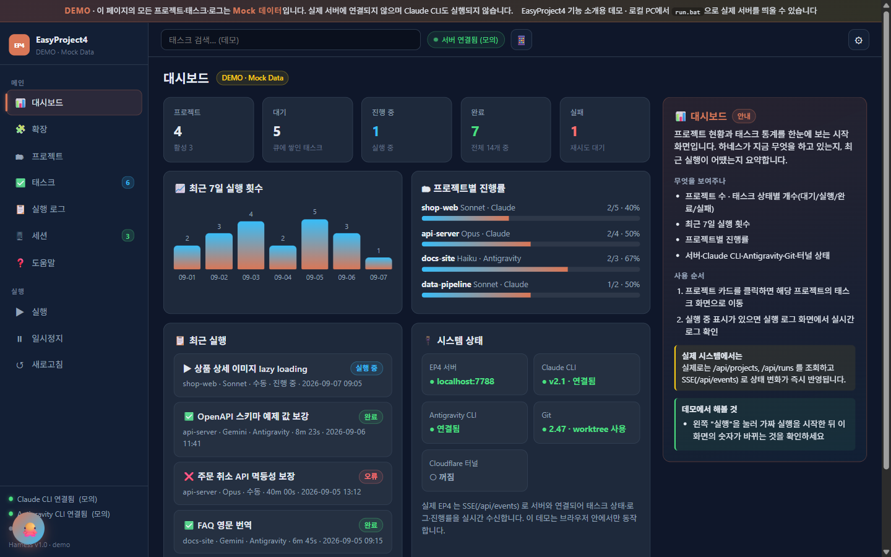</a>

<sub>위 화면은 <a href="https://easyproject4-demo.pages.dev">데모 사이트</a>를 캡처한 것으로 모든 프로젝트·태스크·로그는 Mock 데이터입니다. 실제 저장소나 실행 기록이 아닙니다.</sub>

</div>

프로젝트별로 할 일(태스크)을 큐에 쌓아두면 EP4가 순서대로 Claude CLI를 실행하고,
Git 브랜치 격리 → 커밋 → main 머지까지 자동으로 처리합니다.
웹 대시보드·Flutter 모바일 앱·Electron 데스크톱 앱에서 같은 상태를 실시간으로 확인할 수 있습니다.

```
할 일을 적는다 → 실행을 누른다 → 커피를 마신다 → diff 를 확인한다
```

> ⚠️ EP4는 Claude CLI를 `--dangerously-skip-permissions` 로 실행할 수 있습니다. 신뢰할 수 있는 저장소에서만 사용하고, 태스크가 만든 변경은 머지 전에 diff로 확인하세요.

---

## 주요 기능

- **태스크 하네스** — 태스크 순차 실행, 실행 중 추가 요청은 큐잉 후 이어서 실행, 태스크별 모델/타임아웃/세션 오버라이드
- **Git 자동화** — 태스크마다 `project/{slug}/taskNNN` worktree 브랜치에서 격리 실행, 완료 시 프로젝트 브랜치를 거쳐 main까지 자동 머지 (충돌 시 안전하게 중단)
- **웹 대시보드** — 프로젝트/태스크/실행 로그(diff·커밋 포함)를 한 화면에서, SSE 실시간 갱신
- **Flutter 모바일 앱** — Cloudflare Tunnel로 외부에서 접속, 태스크 지시·실행·로그 확인, 서버에서 APK 자가 업데이트
- **Claude CLI 연동** — MCP 도구(`ep4_create_task` 등)와 훅(UserPromptSubmit/Stop)으로 터미널 대화가 자동으로 태스크·실행 로그로 기록. Gemini CLI(Antigravity)도 동일 훅 재사용
- **멀티 PC(peer)** — 여러 EP4 인스턴스 연결, NAT 뒤 PC는 push 방식으로 프로젝트 공유·원격 태스크 지시
- **플러그인 아키텍처** — pluggy 훅 기반. 화면은 `plugin.json` + `view.js`, 백엔드는 `backend.py` 폴더 하나로 확장. 스킬/에이전트 마켓 공유 지원

---

## 화면 소개

대시보드의 메뉴는 모두 플러그인이며, 왼쪽 목록은 설치·활성 상태에 따라 실시간으로 바뀝니다.
아래 화면은 [데모 사이트](https://easyproject4-demo.pages.dev)에서 직접 눌러 볼 수 있고, 각 화면 오른쪽 안내 상자가 메뉴의 용도와 사용 순서를 설명합니다.

<table>
  <tr>
    <td width="50%" align="center">
      <a href="https://easyproject4-demo.pages.dev/#/projects">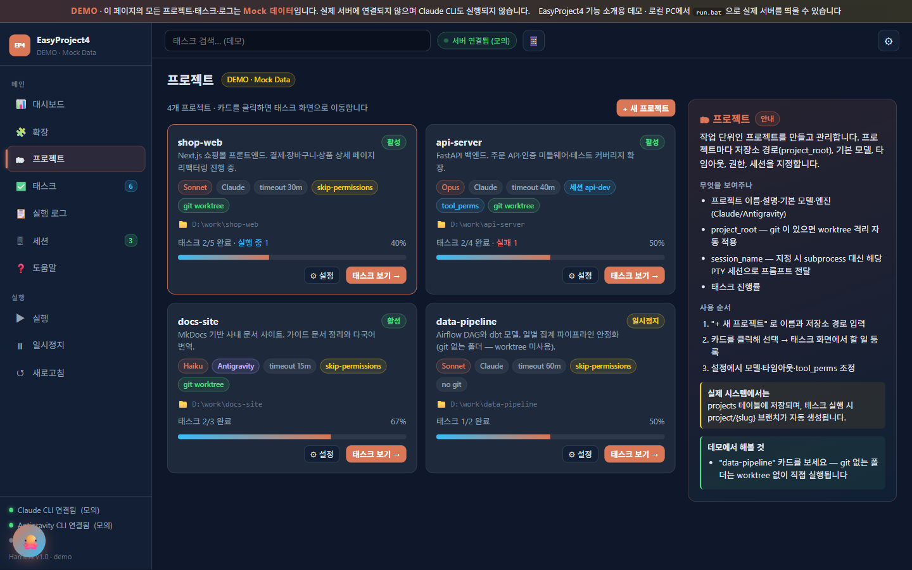</a><br/>
      <b>🗂 프로젝트</b><br/>
      <sub>저장소 경로·기본 모델·엔진(Claude/Antigravity)·타임아웃·세션을 프로젝트마다 지정. <code>project_root</code>에 git이 있으면 worktree 격리가 자동으로 켜집니다</sub>
    </td>
    <td width="50%" align="center">
      <a href="https://easyproject4-demo.pages.dev/#/todo">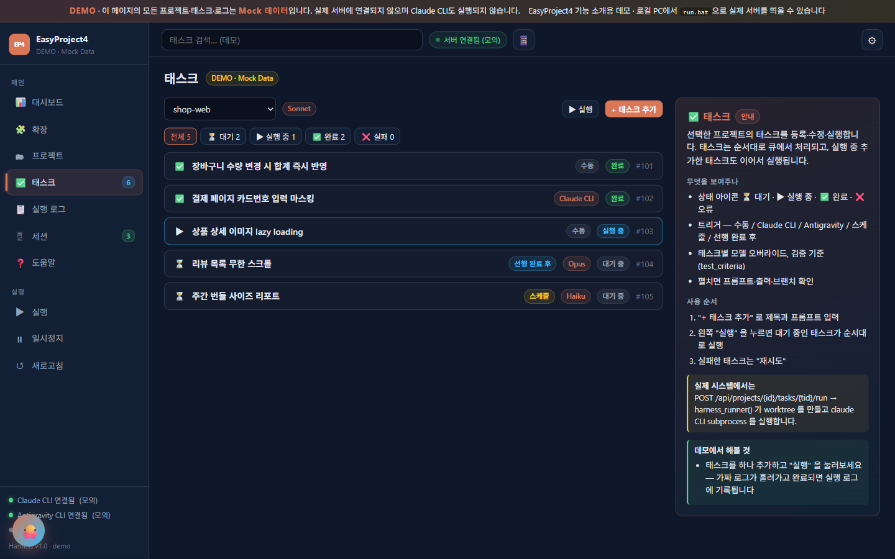</a><br/>
      <b>✅ 태스크</b><br/>
      <sub>할 일과 프롬프트를 큐에 등록. 트리거(수동·스케줄·선행 완료 후)와 모델을 태스크별로 바꾸고, 상태 필터로 대기·실행·완료·실패를 나눠 봅니다</sub>
    </td>
  </tr>
  <tr>
    <td colspan="2" align="center">
      <a href="https://easyproject4-demo.pages.dev/#/log">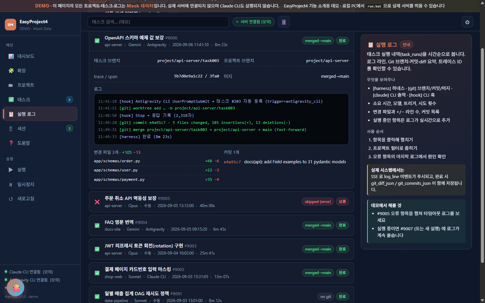</a><br/>
      <b>📋 실행 로그</b><br/>
      <sub><code>[harness]</code> 하네스 · <code>[git]</code> 브랜치/커밋/머지 · <code>[claude]</code> CLI 출력 · <code>[hook]</code> CLI 훅이 시간순으로 쌓입니다.<br/>펼치면 태스크 브랜치, trace/span ID, 변경 파일별 +/− 라인 수, 커밋 목록까지 한 화면에서 확인할 수 있습니다</sub>
    </td>
  </tr>
  <tr>
    <td width="50%" align="center">
      <a href="https://easyproject4-demo.pages.dev/#/sessions">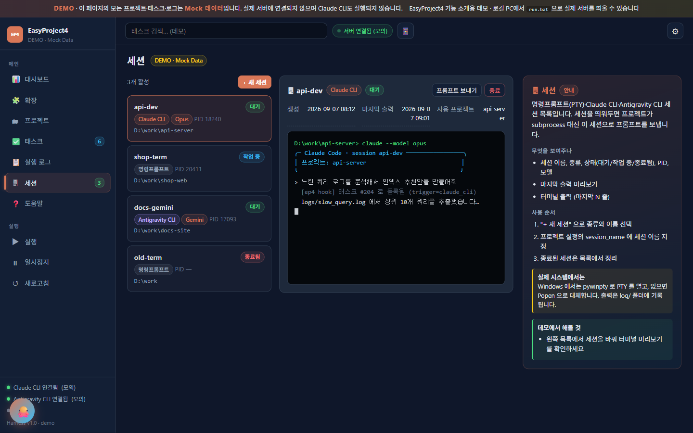</a><br/>
      <b>🖥 세션</b><br/>
      <sub>명령프롬프트(PTY)·Claude CLI·Antigravity CLI 세션을 띄워두고 관리. 프로젝트에 <code>session_name</code>을 지정하면 subprocess 대신 그 세션으로 프롬프트가 전달되어 대화 맥락이 유지됩니다</sub>
    </td>
    <td width="50%" align="center">
      <a href="https://easyproject4-demo.pages.dev/#/plugins">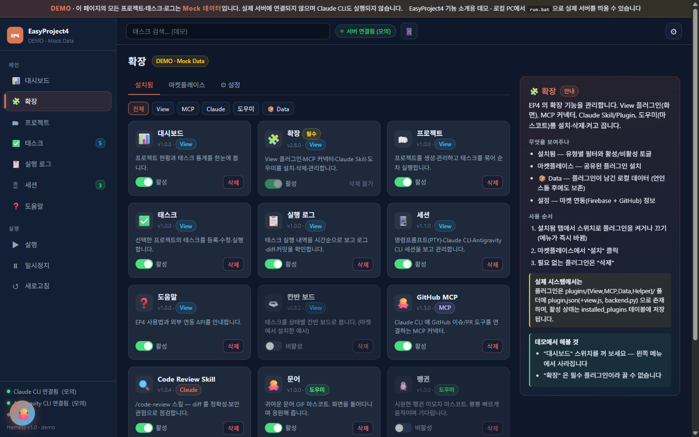</a><br/>
      <b>🧩 확장</b><br/>
      <sub>View 플러그인·MCP 커넥터·Claude Skill·도우미를 설치·삭제·토글. 스위치를 끄면 왼쪽 메뉴에서 즉시 사라지고, 언인스톨해도 플러그인 데이터는 보존됩니다</sub>
    </td>
  </tr>
  <tr>
    <td colspan="2" align="center">
      <a href="https://easyproject4-demo.pages.dev/#/help">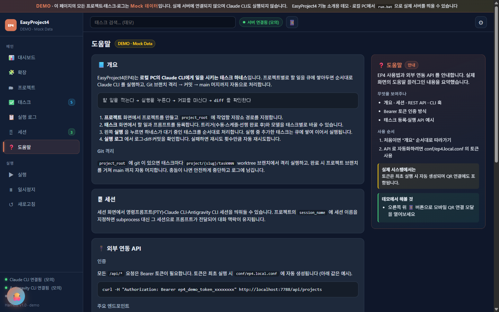</a><br/>
      <b>❓ 도움말</b><br/>
      <sub>사용 순서, Git 격리 방식, Bearer 토큰 인증과 REST API 엔드포인트, Claude CLI·Antigravity CLI 훅과 MCP 도구를 한곳에 정리했습니다</sub>
    </td>
  </tr>
  <tr>
    <td colspan="2" align="center">
      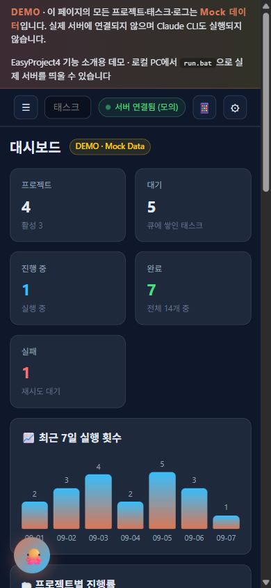
      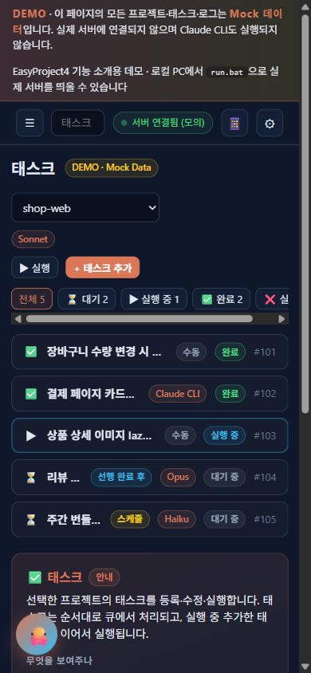
      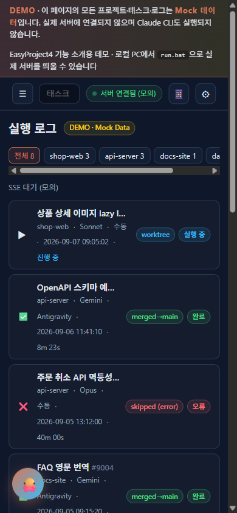<br/>
      <b>📱 모바일</b><br/>
      <sub>같은 대시보드가 좁은 화면에 맞춰 재배치됩니다. Flutter 앱은 <code>tunnel.bat</code>의 Cloudflare 터널로 접속하며, 헤더의 📱 버튼이 서버 주소와 인증 토큰을 담은 QR을 띄웁니다</sub>
    </td>
  </tr>
</table>

<div align="center">
<sub>테마는 다크·라이트·미드나잇·포레스트·선셋 5종이며 오른쪽 위 ⚙ 에서 바꿉니다. 위 캡처는 기본 다크 테마입니다.</sub>
</div>

---

## 빠른 시작

요구 사항: Windows, [conda](https://docs.conda.io/), [Claude CLI](https://docs.anthropic.com/claude-code) (또는 Gemini CLI)

```bat
run.bat
```

conda 환경 생성부터 패키지 설치, 서버 기동까지 한 번에 처리합니다.
브라우저에서 `http://localhost:7788` 접속 후 프로젝트를 만들고 `project_root`에
작업할 저장소 경로를 지정하면 준비 끝입니다.

| 스크립트 | 역할 |
|----------|------|
| `run.bat` | EP4 서버 시작 (localhost:7788) |
| `tunnel.bat` | Cloudflare 임시 터널 — 공인 IP 없이 외부/모바일 접속 |
| `mobile.bat` | Flutter 앱 실행 (`mobile.bat chrome` 등 디바이스 지정 가능) |
| `desktop.bat` | Electron 데스크톱 앱 개발 모드 |
| `stop.bat` | 서버 종료 |

## 아키텍처

EP4는 `server.py` 한 프로세스가 **HTTP 서버 · 하네스 실행 엔진 · 세션 관리 · 이벤트 허브**를 모두 맡습니다.
외부 의존성을 최소화해 파이썬 표준 라이브러리를 중심으로 구현했고, 확장은 플러그인으로 분리했습니다.

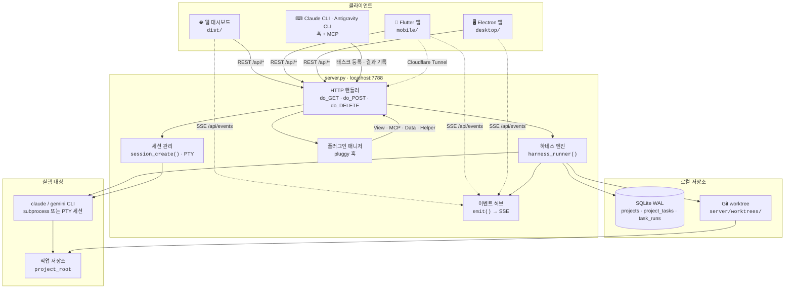

| 구성 | 역할 |
|------|------|
| `server.py` | HTTP 서버 + 하네스 실행 엔진. 태스크 순차 실행, Git 격리, SSE 푸시를 모두 담당 |
| `dist/` | 웹 대시보드 정적 파일. 메뉴는 `/api/plugins` 레지스트리로 동적 구성 |
| `server/projects.db` | SQLite(WAL). `projects` · `project_tasks` · `task_runs` |
| `server/worktrees/` | 태스크별 Git worktree 작업 공간 |
| `plugins/` | `View` 화면 · `MCP` 커넥터 · `Data` 데이터 · `Helper` 도우미. pluggy 훅으로 백엔드 확장 |
| `ep4_mcp.py` | Claude CLI용 MCP 서버 (`ep4_create_task`, `ep4_log_result` 등) |
| `ep4_hook_prompt.py` / `ep4_hook_stop.py` | CLI 훅. 터미널 대화를 태스크·실행 로그로 자동 기록 |

### 태스크 실행 흐름

`project_root`에 git이 있으면 태스크마다 격리 브랜치를 만들고, 끝나면 프로젝트 브랜치를 거쳐 main까지 자동으로 합칩니다.
git이 없는 폴더는 worktree 없이 그 자리에서 실행합니다.

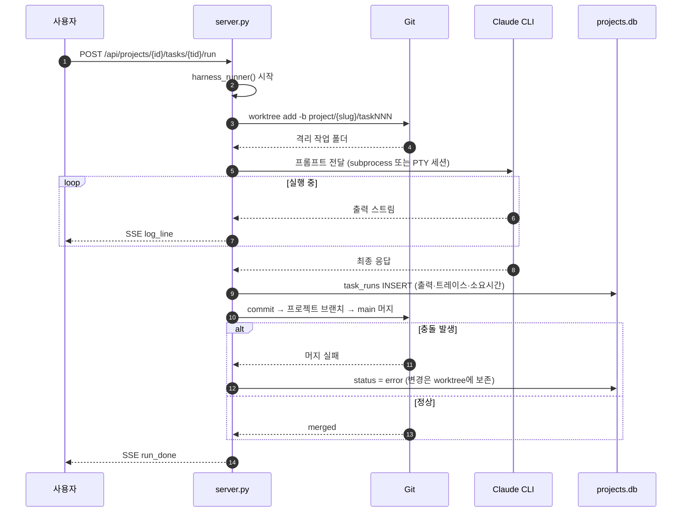

> 실행 중에 태스크를 더 추가하면 큐에 쌓였다가 현재 태스크가 끝난 뒤 이어서 실행됩니다.
> 실패한 태스크는 프로젝트의 `retry_count` 만큼 자동 재시도합니다.

## 문서

| 문서 | 내용 |
|------|------|
| [CLAUDE.md](CLAUDE.md) | 코드베이스 구조·규칙 (Claude Code용 가이드 겸 아키텍처 문서) |
| [docs/tunnel_guide.md](docs/guide/tunnel_guide.md) | Cloudflare Tunnel 외부 접속 가이드 |
| [docs/mcp_guide.md](docs/prompt/mcp_guide.md) | Claude CLI MCP·훅 연동 가이드 |
| [docs/mobile_guide.md](docs/prompt/mobile_guide.md) | 모바일 앱 빌드·연결 가이드 |
| [docs/plugin_architecture_design.md](docs/guide/plugin_architecture_design.md) | 플러그인 아키텍처 설계 |
| [docs/examples/backend_plugin/](docs/examples/backend_plugin/) | 백엔드 플러그인 작성 템플릿 |

## 설정 파일

- `conf/ep4.conf` — 포트·바인드 주소 (기본 localhost:7788)
- `conf/ep4.local.conf` — 인증 토큰·Firebase 주소 등 로컬 전용 값 (**커밋 금지**, `.gitignore` 처리됨)
- `conf/ep4.local.conf.example` — 로컬 설정 예시
- `conf/marketplace.conf.example` — 마켓(Firebase) 연동 설정 예시

### 터널 URL 공유 (선택)

`tunnel.bat` 이 발급한 Cloudflare 터널 URL 을 Firebase Realtime DB 에 올려두면,
모바일 앱에서 긴 URL 대신 **EP4 ID** 만으로 접속할 수 있습니다. 쓰지 않아도 무방합니다.

```jsonc
// conf/ep4.local.conf
{ "firebase_db_url": "https://<프로젝트>-default-rtdb.firebaseio.com" }
```

- 값이 없으면 터널 URL 업로드와 앱의 "EP4 ID" 탭 연결만 건너뛰고, 나머지는 그대로 동작합니다.
- 서비스 계정 키는 `conf/*adminsdk*.json` 에 두며 역시 커밋되지 않습니다.
- 앱은 빌드 시점에 값이 필요하므로 `mobile.bat` 이 이 설정을 읽어 `--dart-define` 으로 전달합니다.
- **DB 주소는 저장소에 넣지 마세요.** 인증 없이 읽는 구조라 주소가 알려지면 터널 URL 이 노출됩니다.

## Third-Party

이 프로젝트에 포함된 오픈소스 고지는 [THIRD-PARTY-NOTICES](THIRD-PARTY-NOTICES)를 참조하세요.
